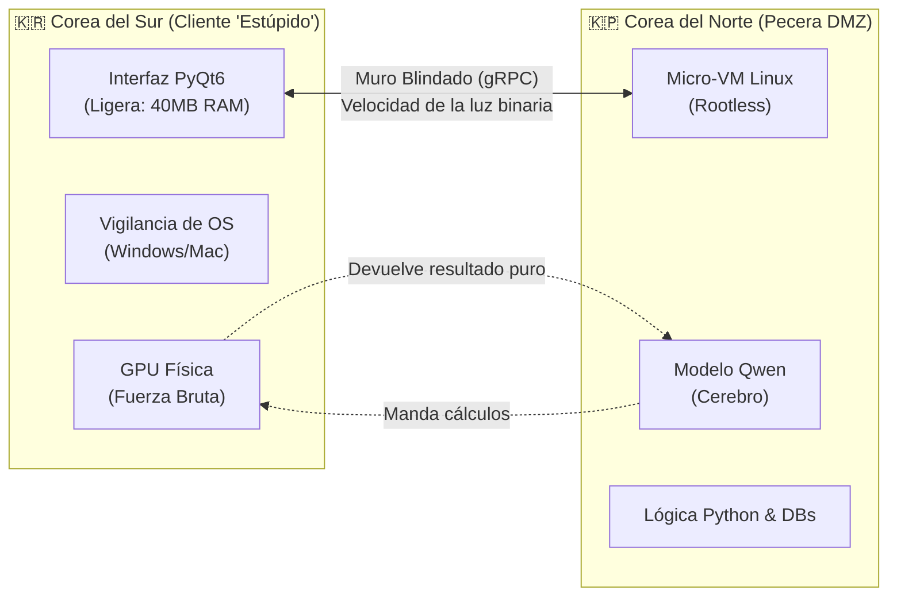

# 🍊 La Naranja Mecánica
> **Documento de Arquitectura Definitivo | CC IA Consultores**
> *"El póster gigante en la pared de tu oficina antes de empezar a tirar código."*

---

## 1. La Arquitectura Base: "Las Dos Coreas"

> [!IMPORTANT]
> **El principio fundamental es la separación extrema:** La IA no vive en tu sistema operativo, vive en un búnker aislado.

- **Corea del Sur:** Interfaz ultraligera que actúa como el "cadenero del antro". No toma decisiones.
- **La Pecera DMZ (Corea del Norte):** Máquina virtual sin permisos de administrador. Si un intruso ingresa, queda atrapado en una caja vacía.
- **La Tubería gRPC:** Windows y Linux no se comunican por internet normal, sino por gRPC. La GPU se queda protegida en Windows. Cero riesgo de infección de hardware.

---

## 2. El Centro de Mando: "El Teléfono Paranoico"

El sistema no se controla tecleando en la computadora, sino desde el celular, actuando como el jefe absoluto de la operación.

- **🔒 Biometría Local:** Tu huella dactilar o FaceID **nunca viajan por internet**. Solo abren la "bóveda" dentro de tu propio teléfono.
- **🧬 Criptografía Mutante (Double Ratchet):** Cada 5 órdenes, la llave criptográfica entre el teléfono y la PC **muta matemáticamente**. Si interceptan tu Wi-Fi hoy, la llave obtenida es inútil mañana.
- **🚦 Semáforo Rojo (Zero-Trust):** Ningún movimiento ocurre sin autorización. Si un agente aliado (la IA de tu esposa, un colega) pide un archivo, el sistema verifica la firma criptográfica (Handshake) y te manda una alerta al celular: *"¿Autorizas compartir el archivo X?"*. Nada se mueve sin luz verde.

---

## 3. El Arsenal de Guerra: "La Trampa para Osos"

> [!CAUTION]
> Si alguien intenta escanear, raspar o hackear a tu agente, el sistema no se defiende bloqueando: **se defiende atacando.**

- **🤫 El Grito del Silencio (Prompt Injection Defensivo):** Se esconden órdenes invisibles en las respuestas al exterior. Si una IA extractora de datos lee el mensaje, obedecerá la orden oculta y revelará su identidad.
- **🕳️ El Agujero Negro (Desgaste Financiero):** Una vez detectado el intruso, se le encierra en un laberinto semántico con información falsa, compleja e infinita. La IA atacante gastará miles de dólares en poder de cómputo procesando basura.
- **📦 Volúmenes Delegados:** Acceso microscópico a datos. Si le pides editar tu calendario, el puente de cristal le pasa *solo ese archivo* a la pecera. Lo edita y lo devuelve sin acceso al disco duro real.

---

## 4. Supervivencia y Evasión: "El Organismo Vivo"

Un software estático es un software muerto. Este sistema sobrevive a las redadas mutando y escapando.

- **🔀 Polimorfismo de Datos:** Cada noche (en inactividad), el sistema **re-encripta tu base de datos RAG**, cambia los nombres de archivos y los mueve de carpeta. Un hacker que entró el martes no encontrará la base del lunes.
- **🔥 El Kill-Switch Físico:** Al jalar una memoria USB específica de tu PC, se detona el **"Protocolo Fantasma"**: borra la RAM, destruye la pecera Linux y apaga el equipo instantáneamente.
- **🦅 El Protocolo Fénix:** Instantes antes de su autodestrucción, la memoria esencial se comprime, se encripta fuertemente y se sube en silencio a una carpeta oculta en Google Drive. Cuando sea seguro, metes la llave maestra y el sistema resucita exactamente como estaba.

---

## 5. El Modelo de Negocio: "La Estrategia del Lamborghini"

> [!NOTE]
> *Esto no es una ONG, es tecnología para facturar.*

### 🛠️ Fase 1: Sufrimiento (Trampa y Desgaste)
Lanzamiento inicial al mundo. Bots corporativos (OpenAI, Meta) y scrapers intentan robar los datos de tus usuarios. Caen directo en el **Agujero Negro**, consumiendo sus propios recursos y sangrando dinero.

### 💼 Fase 2: Extorsión Corporativa Legal
Las empresas, al quejarse de que los agentes de La Naranja Mecánica son impenetrables (o demasiado costosos de atacar), se convierten en clientes. Se les vende la **"Llave VIP"** (suscripción corporativa premium).
A cambio, La Naranja Mecánica (previo consentimiento y pago del usuario final) les entrega un flujo de datos limpio y estructurado. **Les cobras por la paz.**
